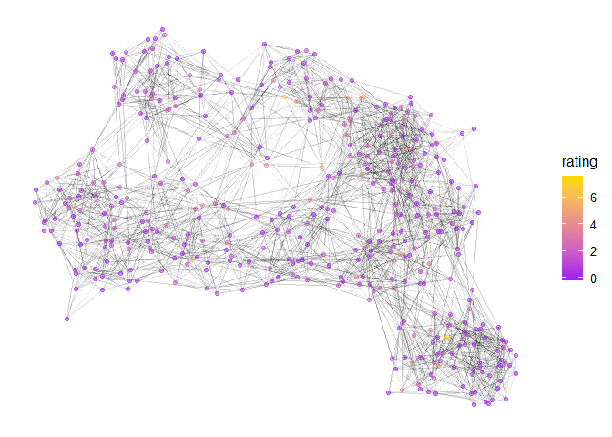
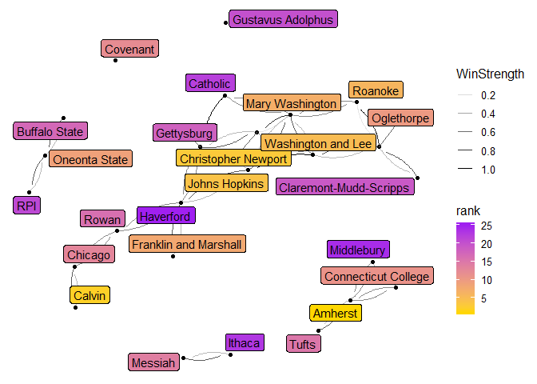
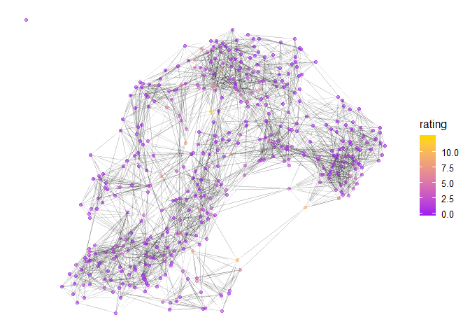
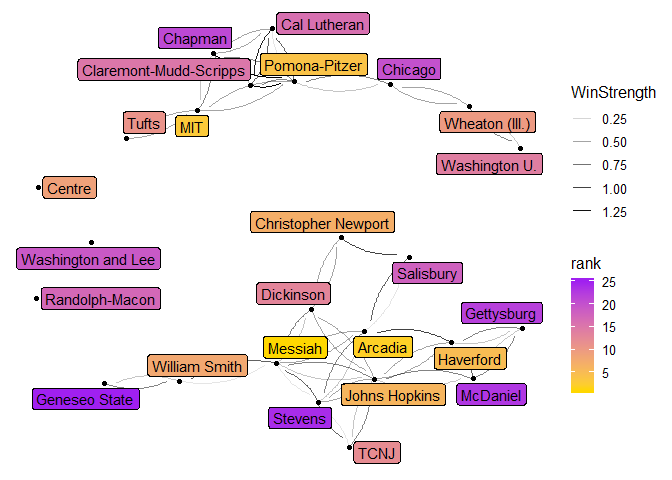

# Men
 


```r
n<-network.initialize(length(all_teams), directed = FALSE, multiple = FALSE)
rankedteams <- rankedteams %>% mutate(ranking = min_rank(desc(Rating)))
network.vertex.names(n) <- as.character(all_teams)
n %v% "rank" <- arrange(rankedteams,match( Team, all_teams))$ranking
n %v% "rating" <- arrange(rankedteams,match( Team, all_teams))$Rating
n %v% "conference" <- as.character(all_conferences)

network.adjacency(as.matrix(A_unnormed), n, ignore.eval=FALSE, names.eval = c("WinStrength"))
```
## Top 25

```r
#rankedteams %>% select(ranking, Team, Rating) %>% knitr::kable()

rankedteams %>% filter(ranking <= 25) %>% select(ranking, Team, Rating, Conference) %>% knitr::kable()
```


 ranking  Team                       Rating  Conference 
--------  ----------------------  ---------  -----------
       1  Mary Washington          7.464111  CAC        
       2  Amherst                  7.172172  NESCAC     
       3  Tufts                    6.804878  NESCAC     
       4  Washington and Lee       6.462490  ODAC       
       5  Johns Hopkins            6.303254  CC         
       6  Roanoke                  6.280562  ODAC       
       7  Covenant                 5.790168  USAC       
       8  Calvin                   4.774913  MIAA       
       9  Christopher Newport      4.746544  CAC        
      10  Hardin-Simmons           4.704277  ASC        
      11  Catholic                 4.607719  LAND       
      12  Loras                    4.532310  ARC        
      13  Connecticut College      4.529007  NESCAC     
      14  Eastern Connecticut      4.348730  LEC        
      15  Gustavus Adolphus        4.082904  MIAC       
      16  Middlebury               4.080217  NESCAC     
      17  Gettysburg               4.028624  CC         
      18  Franklin and Marshall    4.027184  CC         
      19  Messiah                  3.986144  MACC       
      20  Oglethorpe               3.818965  SAA        
      21  Oneonta State            3.630584  SUNYAC     
      22  Rutgers-Camden           3.443313  NJAC       
      23  Hobart                   3.373135  LL         
      24  Ithaca                   3.359468  LL         
      25  RPI                      3.355243  LL         

```r
rankedteams %>% filter(Conference=="ARC") %>% select(ranking, Team, Rating, Conference) %>% knitr::kable()
```


 ranking  Team                    Rating  Conference 
--------  ------------------  ----------  -----------
      12  Loras                4.5323104  ARC        
      27  Central              3.1296900  ARC        
      90  Luther               1.4885875  ARC        
      97  Simpson              1.4134748  ARC        
     151  Wartburg             0.8755615  ARC        
     201  Dubuque              0.5889326  ARC        
     271  Nebraska Wesleyan    0.3000976  ARC        
     364  Coe                  0.0815783  ARC        
     384  Buena Vista          0.0460318  ARC        

```r
rankedteams %>% filter(Team == "Loras")
```

```
##    Team  Rating Conference ranking
## 1 Loras 4.53231        ARC      12
```

## Game Network


```r
#net<-ggnetwork(n %s% which( n %v% "rank" < 26), layout="fruchtermanreingold")
net<-ggnetwork(n , layout="fruchtermanreingold")
ggplot(net, aes(x = x, y = y, xend = xend, yend = yend))+
  geom_edges(alpha=0.1)+
  geom_nodes( aes(color=rating), alpha=0.5 ) +theme_blank()+
  scale_color_gradient(low="purple", high="gold")#+
```

<!-- -->

```r
#  geom_nodelabel_repel(aes(label=vertex.names))
```


```r
net<-ggnetwork(n %s% which( n %v% "rank" < 26), layout="fruchtermanreingold")
#net<-ggnetwork(n , layout="fruchtermanreingold")
ggplot(net, aes(x = x, y = y, xend = xend, yend = yend))+
  geom_edges(aes(alpha=WinStrength), curvature = 0.2)+
  geom_nodes(  ) +theme_blank()+
  geom_nodelabel_repel(aes(label=vertex.names, fill=rank))+
  scale_color_gradient(low="purple", high="gold")+
  scale_fill_gradient(low="gold", high="purple")
```

<!-- -->
# Women


```r
n<-network.initialize(length(all_teams), directed = FALSE, multiple = TRUE)
rankedteams <- rankedteams %>% mutate(ranking = min_rank(desc(Rating)))
network.vertex.names(n) <- as.character(all_teams)
n %v% "rank" <- arrange(rankedteams,match( Team, all_teams))$ranking
n %v% "rating" <- arrange(rankedteams,match( Team, all_teams))$Rating
n %v% "conference" <- as.character(all_conferences)

network.adjacency(as.matrix(A_unnormed), n, ignore.eval=FALSE, names.eval = c("WinStrength"))
```
## Top 25


```r
#rankedteams %>% select(ranking, Team, Rating) %>% knitr::kable()

rankedteams %>% filter(ranking <= 25) %>% select(ranking, Team, Rating, Conference) %>% knitr::kable()
```


 ranking  Team                       Rating  Conference 
--------  ---------------------  ----------  -----------
       1  Pomona-Pitzer           13.933841  SCIAC      
       2  Messiah                 12.156177  MACC       
       3  Arcadia                 11.887298  MACC       
       4  Gettysburg              11.124558  CC         
       5  MIT                      8.965649  NEWMAC     
       6  Wheaton (Ill.)           8.964118  CCIW       
       7  William Smith            8.854496  LL         
       8  TCNJ                     8.650294  NJAC       
       9  Johns Hopkins            8.625065  CC         
      10  Centre                   8.180126  SAA        
      11  Christopher Newport      8.074529  CAC        
      12  Case Western Reserve     7.297681  UAA        
      13  Washington U.            7.259371  UAA        
      14  Chicago                  7.225257  UAA        
      15  Geneseo State            6.427438  SUNYAC     
      16  Washington and Lee       5.783505  ODAC       
      17  Middlebury               5.325440  NESCAC     
      18  Randolph-Macon           5.248549  ODAC       
      19  Stevens                  5.140298  MACF       
      20  McDaniel                 4.841543  CC         
      21  Chapman                  4.757339  SCIAC      
      22  Tufts                    4.629631  NESCAC     
      23  Rochester                4.627391  UAA        
      24  Swarthmore               4.287206  CC         
      25  Dickinson                4.270382  CC         

```r
rankedteams %>% filter(Conference=="ARC") %>% select(ranking, Team, Rating, Conference) %>% knitr::kable()
```


 ranking  Team                    Rating  Conference 
--------  ------------------  ----------  -----------
      36  Wartburg             2.8093125  ARC        
      82  Dubuque              1.3804798  ARC        
      97  Loras                1.2436834  ARC        
     127  Nebraska Wesleyan    0.9552403  ARC        
     142  Simpson              0.8604048  ARC        
     167  Coe                  0.5678234  ARC        
     232  Luther               0.2541980  ARC        
     240  Central              0.2341842  ARC        
     404  Buena Vista          0.0028414  ARC        

```r
rankedteams %>% filter(Team=="Loras")
```

```
##    Team   Rating Conference ranking
## 1 Loras 1.243683        ARC      97
```

## Game Network


```r
#net<-ggnetwork(n %s% which( n %v% "rank" < 26), layout="fruchtermanreingold")
net<-ggnetwork(n , layout="fruchtermanreingold")
ggplot(net, aes(x = x, y = y, xend = xend, yend = yend))+
  geom_edges(alpha=0.1)+
  geom_nodes( aes(color=rating), alpha=0.5 ) +theme_blank()+
  scale_color_gradient(low="purple", high="gold")#+
```

<!-- -->

```r
#  geom_nodelabel_repel(aes(label=vertex.names))
```


```r
net<-ggnetwork(n %s% which( n %v% "rank" < 26), layout="fruchtermanreingold")
#net<-ggnetwork(n , layout="fruchtermanreingold")
ggplot(net, aes(x = x, y = y, xend = xend, yend = yend))+
  geom_edges(aes(alpha=WinStrength), curvature = 0.2)+
  geom_nodes(  ) +theme_blank()+
  geom_nodelabel_repel(aes(label=vertex.names, fill=rank))+
  scale_color_gradient(low="purple", high="gold")+
  scale_fill_gradient(low="gold", high="purple")
```

<!-- -->
