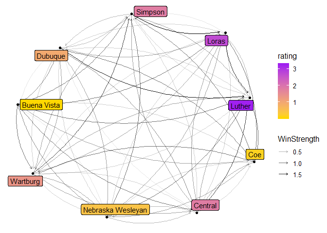
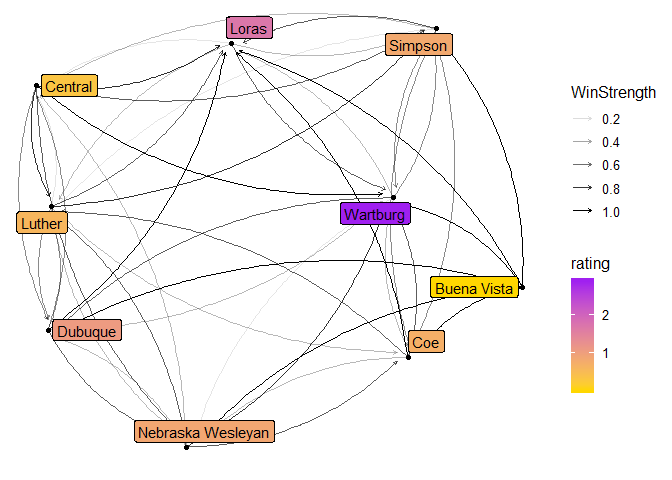

# Men
 


```r
n<-network.initialize(length(all_teams), directed = TRUE, multiple = FALSE)
rankedteams <- rankedteams %>% mutate(ranking = min_rank(desc(Rating)))
network.vertex.names(n) <- as.character(all_teams)
n %v% "rank" <- arrange(rankedteams,match( Team, all_teams))$ranking
n %v% "rating" <- arrange(rankedteams,match( Team, all_teams))$Rating
n %v% "conference" <- as.character(all_conferences)

network.adjacency(as.matrix(A_unnormed), n, ignore.eval=FALSE, names.eval = c("WinStrength"))
```
## Top 25

```r
#rankedteams %>% select(ranking, Team, Rating) %>% knitr::kable()

rankedteams %>% filter(ranking <= 25) %>% select(ranking, Team, Rating, Conference) %>% knitr::kable()
```


 ranking  Team                        Rating  Conference 
--------  -----------------------  ---------  -----------
       1  Amherst                   7.431017  NESCAC     
       2  Calvin                    5.826105  MIAA       
       3  Christopher Newport       5.751827  CAC        
       4  Johns Hopkins             5.614464  CC         
       5  Washington and Lee        5.323713  ODAC       
       6  Roanoke                   5.285110  ODAC       
       7  Mary Washington           5.076001  CAC        
       8  Franklin and Marshall     4.877566  CC         
       9  Connecticut College       4.651006  NESCAC     
      10  Oneonta State             4.465802  SUNYAC     
      11  Oglethorpe                4.162531  SAA        
      12  Chicago                   3.949507  UAA        
      13  Covenant                  3.900098  USAC       
      14  Messiah                   3.873689  MACC       
      15  Tufts                     3.767652  NESCAC     
      16  Catholic                  3.632685  LAND       
      17  Rowan                     3.531120  NJAC       
      18  Gettysburg                3.495813  CC         
      19  Buffalo State             3.429783  SUNYAC     
      20  Claremont-Mudd-Scripps    3.394567  SCIAC      
      21  Middlebury                3.389944  NESCAC     
      22  RPI                       3.353799  LL         
      23  Gustavus Adolphus         3.239926  MIAC       
      24  Ithaca                    3.229448  LL         
      25  Centre                    3.141976  SAA        

```r
rankedteams %>% filter(Conference=="ARC") %>% select(ranking, Team, Rating, Conference) %>% knitr::kable()
```


 ranking  Team                    Rating  Conference 
--------  ------------------  ----------  -----------
      39  Loras                2.6838015  ARC        
      45  Simpson              2.4777755  ARC        
      47  Luther               2.4165509  ARC        
      49  Central              2.3475013  ARC        
     138  Dubuque              1.0825748  ARC        
     139  Wartburg             1.0610626  ARC        
     195  Nebraska Wesleyan    0.6670168  ARC        
     364  Coe                  0.0934235  ARC        
     383  Buena Vista          0.0573424  ARC        

```r
rankedteams %>% filter(Team == "Loras")
```

```
##    Team   Rating Conference ranking
## 1 Loras 2.683802        ARC      39
```

## Game Network


```r
#net<-ggnetwork(n %s% which( n %v% "rank" < 26), layout="fruchtermanreingold")
net<-ggnetwork(n , layout="fruchtermanreingold")
ggplot(net, aes(x = x, y = y, xend = xend, yend = yend))+
  geom_edges(alpha=0.1)+
  geom_nodes( aes(color=rating), alpha=0.5 ) +theme_blank()+
  scale_color_gradient(low="purple", high="gold")#+
```

<!-- -->

```r
#  geom_nodetext(aes(label=vertex.names))
```


```r
net<-ggnetwork(n %s% which( n %v% "rank" < 26), layout="fruchtermanreingold")
#net<-ggnetwork(n , layout="fruchtermanreingold")
ggplot(net, aes(x = x, y = y, xend = xend, yend = yend))+
  geom_edges(aes(alpha=WinStrength), curvature = 0.2)+
  geom_nodes(  ) +theme_blank()+
  geom_nodelabel_repel(aes(label=vertex.names, fill=rank))+
  scale_color_gradient(low="purple", high="gold")+
  scale_fill_gradient(low="gold", high="purple")
```

<!-- -->


```r
net<-ggnetwork(n %s% which( n %v% "conference" == "ARC"), layout="fruchtermanreingold")
#net<-ggnetwork(n , layout="fruchtermanreingold")
ggplot(net, aes(x = x, y = y, xend = xend, yend = yend))+
  geom_edges(aes(alpha=WinStrength), curvature = 0.2, arrow = arrow(length = unit(3, "points")))+
  geom_nodes(  ) +theme_blank()+
  geom_nodelabel_repel(aes(label=vertex.names, fill=rating))+
  scale_color_gradient(low="purple", high="gold")+
  scale_fill_gradient(low="gold", high="purple")
```

<!-- -->

# Women


```r
n<-network.initialize(length(all_teams), directed = TRUE, multiple = TRUE)
rankedteams <- rankedteams %>% mutate(ranking = min_rank(desc(Rating)))
network.vertex.names(n) <- as.character(all_teams)
n %v% "rank" <- arrange(rankedteams,match( Team, all_teams))$ranking
n %v% "rating" <- arrange(rankedteams,match( Team, all_teams))$Rating
n %v% "conference" <- as.character(all_conferences)

network.adjacency(as.matrix(A_unnormed), n, ignore.eval=FALSE, names.eval = c("WinStrength"))
```
## Top 25


```r
#rankedteams %>% select(ranking, Team, Rating) %>% knitr::kable()

rankedteams %>% filter(ranking <= 25) %>% select(ranking, Team, Rating, Conference) %>% knitr::kable()
```


 ranking  Team                         Rating  Conference 
--------  -----------------------  ----------  -----------
       1  Pomona-Pitzer             13.240923  SCIAC      
       2  Arcadia                   12.936774  MACC       
       3  Messiah                   12.894877  MACC       
       4  MIT                       10.403120  NEWMAC     
       5  William Smith              8.703038  LL         
       6  Haverford                  7.994738  CC         
       7  Tufts                      7.642647  NESCAC     
       8  Washington U.              7.539948  UAA        
       9  Johns Hopkins              7.468788  CC         
      10  Wheaton (Ill.)             7.420427  CCIW       
      11  TCNJ                       7.282450  NJAC       
      12  Centre                     6.827830  SAA        
      13  Gettysburg                 6.756363  CC         
      14  Christopher Newport        6.369530  CAC        
      15  Chicago                    5.929225  UAA        
      16  Dickinson                  5.721778  CC         
      17  Geneseo State              5.655945  SUNYAC     
      18  Washington and Lee         5.407743  ODAC       
      19  Middlebury                 5.286835  NESCAC     
      20  Randolph-Macon             4.993194  ODAC       
      21  Salisbury                  4.986745  CAC        
      22  Claremont-Mudd-Scripps     4.931742  SCIAC      
      23  Stevens                    4.818684  MACF       
      24  McDaniel                   4.802097  CC         
      25  Chapman                    4.628733  SCIAC      

```r
rankedteams %>% filter(Conference=="ARC") %>% select(ranking, Team, Rating, Conference) %>% knitr::kable()
```


 ranking  Team                    Rating  Conference 
--------  ------------------  ----------  -----------
      35  Wartburg             2.9299337  ARC        
      84  Dubuque              1.5088050  ARC        
      94  Loras                1.2744600  ARC        
     101  Nebraska Wesleyan    1.1544314  ARC        
     143  Simpson              0.7992554  ARC        
     170  Coe                  0.5529437  ARC        
     189  Luther               0.4267280  ARC        
     211  Central              0.3517167  ARC        
     416  Buena Vista          0.0016599  ARC        

```r
rankedteams %>% filter(Team=="Loras")
```

```
##    Team  Rating Conference ranking
## 1 Loras 1.27446        ARC      94
```

## Game Network


```r
#net<-ggnetwork(n %s% which( n %v% "rank" < 26), layout="fruchtermanreingold")
net<-ggnetwork(n , layout="fruchtermanreingold")
ggplot(net, aes(x = x, y = y, xend = xend, yend = yend))+
  geom_edges(alpha=0.1)+
  geom_nodes( aes(color=rating), alpha=0.5 ) +theme_blank()+
  scale_color_gradient(low="purple", high="gold")#+
```

<!-- -->

```r
#  geom_nodetext(aes(label=vertex.names))
```


```r
net<-ggnetwork(n %s% which( n %v% "rank" < 26), layout="fruchtermanreingold")
#net<-ggnetwork(n , layout="fruchtermanreingold")
ggplot(net, aes(x = x, y = y, xend = xend, yend = yend))+
  geom_edges(aes(alpha=WinStrength), curvature = 0.2)+
  geom_nodes(  ) +theme_blank()+
  geom_nodelabel_repel(aes(label=vertex.names, fill=rank))+
  scale_color_gradient(low="purple", high="gold")+
  scale_fill_gradient(low="gold", high="purple")
```

<!-- -->

## ARC


```r
net<-ggnetwork(n %s% which( n %v% "conference" == "ARC"), layout="fruchtermanreingold")
#net<-ggnetwork(n , layout="fruchtermanreingold")
ggplot(net, aes(x = x, y = y, xend = xend, yend = yend))+
  geom_edges(aes(alpha=WinStrength), curvature = 0.2, arrow = arrow(length = unit(3, "points")))+
  geom_nodes(  ) +theme_blank()+
  geom_nodelabel_repel(aes(label=vertex.names, fill=rating))+
  scale_color_gradient(low="purple", high="gold")+
  scale_fill_gradient(low="gold", high="purple")
```

<!-- -->
