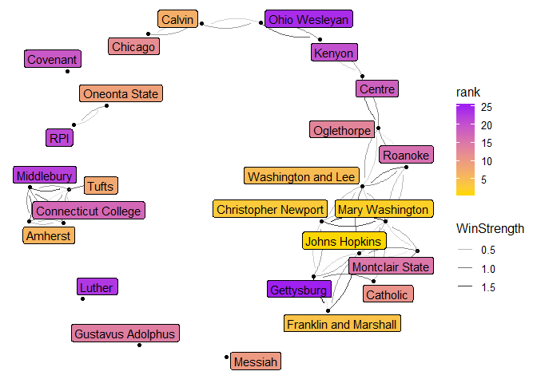
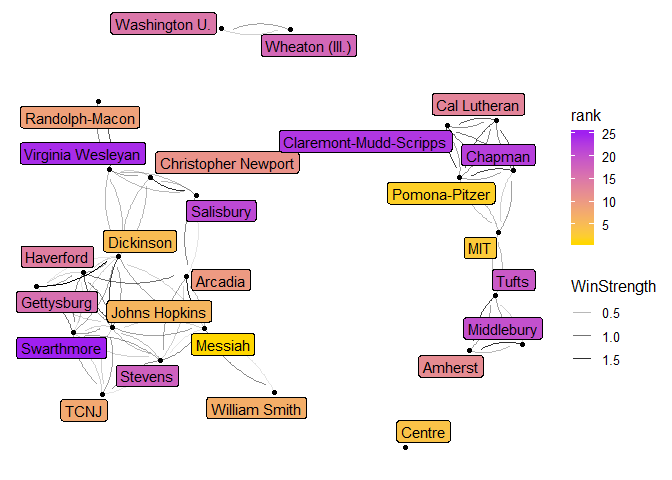

# Men
 


```r
n<-network.initialize(length(all_teams), directed = TRUE, multiple = FALSE)
rankedteams <- rankedteams %>% mutate(ranking = min_rank(desc(Rating)))
network.vertex.names(n) <- as.character(all_teams)
n %v% "rank" <- arrange(rankedteams,match( Team, all_teams))$ranking
n %v% "rating" <- arrange(rankedteams,match( Team, all_teams))$Rating
n %v% "conference" <- as.character(all_conferences)

network.adjacency(as.matrix(A_unnormed), n, ignore.eval=FALSE, names.eval = c("WinStrength"))
```
## Top 25

```r
#rankedteams %>% select(ranking, Team, Rating) %>% knitr::kable()

rankedteams %>% filter(ranking <= 25) %>% select(ranking, Team, Rating, Conference) %>% knitr::kable()
```


 ranking  Team                       Rating  Conference 
--------  ----------------------  ---------  -----------
       1  Amherst                  6.745163  NESCAC     
       2  Christopher Newport      6.047967  CAC        
       3  Johns Hopkins            5.951422  CC         
       4  Calvin                   5.696552  MIAA       
       5  Mary Washington          5.618356  CAC        
       6  Washington and Lee       5.208367  ODAC       
       7  Franklin and Marshall    4.539227  CC         
       8  Tufts                    4.236362  NESCAC     
       9  Oneonta State            4.104679  SUNYAC     
      10  Messiah                  4.050696  MACC       
      11  Oglethorpe               3.965092  SAA        
      12  Covenant                 3.887012  USAC       
      13  Gettysburg               3.823062  CC         
      14  RPI                      3.783069  LL         
      15  Chicago                  3.723566  UAA        
      16  Roanoke                  3.701515  ODAC       
      17  Connecticut College      3.277889  NESCAC     
      18  Buffalo State            3.253406  SUNYAC     
      19  Centre                   3.174304  SAA        
      20  Catholic                 3.172489  LAND       
      21  Ohio Wesleyan            3.162806  NCAC       
      22  Montclair State          3.135101  NJAC       
      23  Haverford                3.124062  CC         
      24  Ithaca                   3.111308  LL         
      25  Middlebury               3.069170  NESCAC     

```r
rankedteams %>% filter(Conference=="ARC") %>% select(ranking, Team, Rating, Conference) %>% knitr::kable()
```


 ranking  Team                    Rating  Conference 
--------  ------------------  ----------  -----------
      29  Loras                2.9448491  ARC        
      41  Luther               2.5832320  ARC        
      55  Central              2.1274190  ARC        
      68  Simpson              1.8392863  ARC        
     122  Wartburg             1.2610105  ARC        
     175  Dubuque              0.8262250  ARC        
     227  Nebraska Wesleyan    0.4834393  ARC        
     351  Coe                  0.1220896  ARC        
     391  Buena Vista          0.0455217  ARC        

```r
rankedteams %>% filter(Team == "Loras")
```

```
##    Team   Rating Conference ranking
## 1 Loras 2.944849        ARC      29
```

## Game Network


```r
#net<-ggnetwork(n %s% which( n %v% "rank" < 26), layout="fruchtermanreingold")
net<-ggnetwork(n , layout="fruchtermanreingold")
ggplot(net, aes(x = x, y = y, xend = xend, yend = yend))+
  geom_edges(alpha=0.1)+
  geom_nodes( aes(color=rating), alpha=0.5 ) +theme_blank()+
  scale_color_gradient(low="purple", high="gold")#+
```

<!-- -->

```r
#  geom_nodetext(aes(label=vertex.names))
```


```r
net<-ggnetwork(n %s% which( n %v% "rank" < 26), layout="fruchtermanreingold")
#net<-ggnetwork(n , layout="fruchtermanreingold")
ggplot(net, aes(x = x, y = y, xend = xend, yend = yend))+
  geom_edges(aes(alpha=WinStrength), curvature = 0.2)+
  geom_nodes(  ) +theme_blank()+
  geom_nodelabel_repel(aes(label=vertex.names, fill=rank))+
  scale_color_gradient(low="purple", high="gold")+
  scale_fill_gradient(low="gold", high="purple")
```

<!-- -->


```r
net<-ggnetwork(n %s% which( n %v% "conference" == "ARC"), layout="fruchtermanreingold")
#net<-ggnetwork(n , layout="fruchtermanreingold")
ggplot(net, aes(x = x, y = y, xend = xend, yend = yend))+
  geom_edges(aes(alpha=WinStrength), curvature = 0.2, arrow = arrow(length = unit(3, "points")))+
  geom_nodes(  ) +theme_blank()+
  geom_nodelabel_repel(aes(label=vertex.names, fill=rating))+
  scale_color_gradient(low="purple", high="gold")+
  scale_fill_gradient(low="gold", high="purple")
```

<!-- -->

# Women


```r
n<-network.initialize(length(all_teams), directed = TRUE, multiple = TRUE)
rankedteams <- rankedteams %>% mutate(ranking = min_rank(desc(Rating)))
network.vertex.names(n) <- as.character(all_teams)
n %v% "rank" <- arrange(rankedteams,match( Team, all_teams))$ranking
n %v% "rating" <- arrange(rankedteams,match( Team, all_teams))$Rating
n %v% "conference" <- as.character(all_conferences)

network.adjacency(as.matrix(A_unnormed), n, ignore.eval=FALSE, names.eval = c("WinStrength"))
```
## Top 25


```r
#rankedteams %>% select(ranking, Team, Rating) %>% knitr::kable()

rankedteams %>% filter(ranking <= 25) %>% select(ranking, Team, Rating, Conference) %>% knitr::kable()
```


 ranking  Team                         Rating  Conference 
--------  -----------------------  ----------  -----------
       1  Messiah                   13.286868  MACC       
       2  Arcadia                   10.684429  MACC       
       3  MIT                        9.580927  NEWMAC     
       4  Pomona-Pitzer              9.379832  SCIAC      
       5  Haverford                  8.127622  CC         
       6  Johns Hopkins              8.024442  CC         
       7  William Smith              7.519072  LL         
       8  Centre                     7.422334  SAA        
       9  TCNJ                       7.128627  NJAC       
      10  Christopher Newport        7.095098  CAC        
      11  Tufts                      6.679182  NESCAC     
      12  Dickinson                  6.635610  CC         
      13  Washington U.              6.490058  UAA        
      14  Wheaton (Ill.)             6.320473  CCIW       
      15  Cal Lutheran               5.904375  SCIAC      
      16  Randolph-Macon             5.604036  ODAC       
      17  Salisbury                  5.390860  CAC        
      18  Washington and Lee         5.176458  ODAC       
      19  Chicago                    5.142858  UAA        
      20  Gettysburg                 5.129092  CC         
      21  Claremont-Mudd-Scripps     5.062791  SCIAC      
      22  Chapman                    4.617707  SCIAC      
      23  McDaniel                   4.594391  CC         
      24  Geneseo State              4.581179  SUNYAC     
      25  Stevens                    4.363703  MACF       

```r
rankedteams %>% filter(Conference=="ARC") %>% select(ranking, Team, Rating, Conference) %>% knitr::kable()
```


 ranking  Team                    Rating  Conference 
--------  ------------------  ----------  -----------
      39  Wartburg             2.8020549  ARC        
      89  Loras                1.3759627  ARC        
      99  Dubuque              1.2346940  ARC        
     137  Nebraska Wesleyan    0.8399977  ARC        
     145  Simpson              0.7817894  ARC        
     168  Coe                  0.5970546  ARC        
     180  Luther               0.5314317  ARC        
     233  Central              0.3008642  ARC        
     424  Buena Vista          0.0012284  ARC        

```r
rankedteams %>% filter(Team=="Loras")
```

```
##    Team   Rating Conference ranking
## 1 Loras 1.375963        ARC      89
```

## Game Network


```r
#net<-ggnetwork(n %s% which( n %v% "rank" < 26), layout="fruchtermanreingold")
net<-ggnetwork(n , layout="fruchtermanreingold")
ggplot(net, aes(x = x, y = y, xend = xend, yend = yend))+
  geom_edges(alpha=0.1)+
  geom_nodes( aes(color=rating), alpha=0.5 ) +theme_blank()+
  scale_color_gradient(low="purple", high="gold")#+
```

<!-- -->

```r
#  geom_nodetext(aes(label=vertex.names))
```


```r
net<-ggnetwork(n %s% which( n %v% "rank" < 26), layout="fruchtermanreingold")
#net<-ggnetwork(n , layout="fruchtermanreingold")
ggplot(net, aes(x = x, y = y, xend = xend, yend = yend))+
  geom_edges(aes(alpha=WinStrength), curvature = 0.2)+
  geom_nodes(  ) +theme_blank()+
  geom_nodelabel_repel(aes(label=vertex.names, fill=rank))+
  scale_color_gradient(low="purple", high="gold")+
  scale_fill_gradient(low="gold", high="purple")
```

<!-- -->

## ARC


```r
net<-ggnetwork(n %s% which( n %v% "conference" == "ARC"), layout="fruchtermanreingold")
#net<-ggnetwork(n , layout="fruchtermanreingold")
ggplot(net, aes(x = x, y = y, xend = xend, yend = yend))+
  geom_edges(aes(alpha=WinStrength), curvature = 0.2, arrow = arrow(length = unit(3, "points")))+
  geom_nodes(  ) +theme_blank()+
  geom_nodelabel_repel(aes(label=vertex.names, fill=rating))+
  scale_color_gradient(low="purple", high="gold")+
  scale_fill_gradient(low="gold", high="purple")
```

<!-- -->
