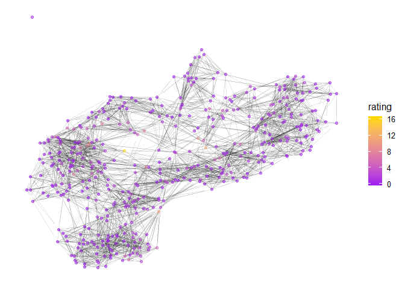

# Men
 


```r
n<-network.initialize(length(all_teams), directed = TRUE, multiple = FALSE)
rankedteams <- rankedteams %>% mutate(ranking = min_rank(desc(Rating)))
network.vertex.names(n) <- as.character(all_teams)
n %v% "rank" <- arrange(rankedteams,match( Team, all_teams))$ranking
n %v% "rating" <- arrange(rankedteams,match( Team, all_teams))$Rating
n %v% "conference" <- as.character(all_conferences)

network.adjacency(as.matrix(A_unnormed), n, ignore.eval=FALSE, names.eval = c("WinStrength"))
```
## Top 25

```r
#rankedteams %>% select(ranking, Team, Rating) %>% knitr::kable()

rankedteams %>% filter(ranking <= 25) %>% select(ranking, Team, Rating, Conference) %>% knitr::kable()
```


 ranking  Team                       Rating  Conference 
--------  ----------------------  ---------  -----------
       1  Johns Hopkins            6.481126  CC         
       2  Amherst                  6.270486  NESCAC     
       3  Mary Washington          5.914372  CAC        
       4  Christopher Newport      5.848371  CAC        
       5  Franklin and Marshall    5.637590  CC         
       6  Washington and Lee       5.588800  ODAC       
       7  Calvin                   5.275193  MIAA       
       8  Tufts                    4.244221  NESCAC     
       9  Oneonta State            4.159203  SUNYAC     
      10  Messiah                  4.030934  MACC       
      11  Oglethorpe               3.977550  SAA        
      12  Roanoke                  3.862536  ODAC       
      13  Catholic                 3.759792  LAND       
      14  Connecticut College      3.744572  NESCAC     
      15  RPI                      3.440957  LL         
      16  Chicago                  3.430156  UAA        
      17  Gettysburg               3.312167  CC         
      18  Montclair State          3.307603  NJAC       
      19  Ohio Wesleyan            3.245932  NCAC       
      20  Haverford                3.159780  CC         
      21  Eastern Connecticut      3.087540  LEC        
      22  Hobart                   3.043130  LL         
      23  Covenant                 3.012370  USAC       
      24  Rutgers-Camden           3.008442  NJAC       
      25  Gustavus Adolphus        3.000708  MIAC       

```r
rankedteams %>% filter(Conference=="ARC") %>% select(ranking, Team, Rating, Conference) %>% knitr::kable()
```


 ranking  Team                    Rating  Conference 
--------  ------------------  ----------  -----------
      41  Luther               2.6298657  ARC        
      43  Loras                2.5258090  ARC        
      60  Central              2.0079999  ARC        
      65  Simpson              1.9337274  ARC        
     108  Wartburg             1.3549259  ARC        
     159  Dubuque              1.0154700  ARC        
     233  Nebraska Wesleyan    0.4668553  ARC        
     335  Coe                  0.1584886  ARC        
     389  Buena Vista          0.0482873  ARC        

```r
rankedteams %>% filter(Team == "Loras")
```

```
##    Team   Rating Conference ranking
## 1 Loras 2.525809        ARC      43
```

## Game Network


```r
#net<-ggnetwork(n %s% which( n %v% "rank" < 26), layout="fruchtermanreingold")
net<-ggnetwork(n , layout="fruchtermanreingold")
ggplot(net, aes(x = x, y = y, xend = xend, yend = yend))+
  geom_edges(alpha=0.1)+
  geom_nodes( aes(color=rating), alpha=0.5 ) +theme_blank()+
  scale_color_gradient(low="purple", high="gold")#+
```

<!-- -->

```r
#  geom_nodetext(aes(label=vertex.names))
```


```r
net<-ggnetwork(n %s% which( n %v% "rank" < 26), layout="fruchtermanreingold")
#net<-ggnetwork(n , layout="fruchtermanreingold")
ggplot(net, aes(x = x, y = y, xend = xend, yend = yend))+
  geom_edges(aes(alpha=WinStrength), curvature = 0.2)+
  geom_nodes(  ) +theme_blank()+
  geom_nodelabel_repel(aes(label=vertex.names, fill=rank))+
  scale_color_gradient(low="purple", high="gold")+
  scale_fill_gradient(low="gold", high="purple")
```

<!-- -->


```r
net<-ggnetwork(n %s% which( n %v% "conference" == "ARC"), layout="fruchtermanreingold")
#net<-ggnetwork(n , layout="fruchtermanreingold")
ggplot(net, aes(x = x, y = y, xend = xend, yend = yend))+
  geom_edges(aes(alpha=WinStrength), curvature = 0.2, arrow = arrow(length = unit(3, "points")))+
  geom_nodes(  ) +theme_blank()+
  geom_nodelabel_repel(aes(label=vertex.names, fill=rating))+
  scale_color_gradient(low="purple", high="gold")+
  scale_fill_gradient(low="gold", high="purple")
```

<!-- -->

# Women


```r
n<-network.initialize(length(all_teams), directed = TRUE, multiple = TRUE)
rankedteams <- rankedteams %>% mutate(ranking = min_rank(desc(Rating)))
network.vertex.names(n) <- as.character(all_teams)
n %v% "rank" <- arrange(rankedteams,match( Team, all_teams))$ranking
n %v% "rating" <- arrange(rankedteams,match( Team, all_teams))$Rating
n %v% "conference" <- as.character(all_conferences)

network.adjacency(as.matrix(A_unnormed), n, ignore.eval=FALSE, names.eval = c("WinStrength"))
```
## Top 25


```r
#rankedteams %>% select(ranking, Team, Rating) %>% knitr::kable()

rankedteams %>% filter(ranking <= 25) %>% select(ranking, Team, Rating, Conference) %>% knitr::kable()
```


 ranking  Team                         Rating  Conference 
--------  -----------------------  ----------  -----------
       1  Messiah                   12.880723  MACC       
       2  Dickinson                  8.931292  CC         
       3  Pomona-Pitzer              8.794875  SCIAC      
       4  MIT                        8.431233  NEWMAC     
       5  Centre                     8.005326  SAA        
       6  Arcadia                    7.879124  MACC       
       7  Christopher Newport        7.764926  CAC        
       8  TCNJ                       7.584012  NJAC       
       9  Johns Hopkins              7.377390  CC         
      10  William Smith              7.220675  LL         
      11  Randolph-Macon             6.886701  ODAC       
      12  Wheaton (Ill.)             6.271972  CCIW       
      13  Haverford                  6.220641  CC         
      14  Gettysburg                 6.185129  CC         
      15  Cal Lutheran               6.047121  SCIAC      
      16  Washington U.              5.919239  UAA        
      17  Salisbury                  5.542000  CAC        
      18  Tufts                      5.331358  NESCAC     
      19  Claremont-Mudd-Scripps     5.009162  SCIAC      
      20  Swarthmore                 4.711760  CC         
      21  McDaniel                   4.685336  CC         
      22  Chapman                    4.649165  SCIAC      
      23  Stevens                    4.490982  MACF       
      24  Washington and Lee         4.217820  ODAC       
      25  Middlebury                 4.131231  NESCAC     

```r
rankedteams %>% filter(Conference=="ARC") %>% select(ranking, Team, Rating, Conference) %>% knitr::kable()
```


 ranking  Team                    Rating  Conference 
--------  ------------------  ----------  -----------
      48  Wartburg             2.5352842  ARC        
      77  Loras                1.6736156  ARC        
     106  Dubuque              1.2078086  ARC        
     139  Simpson              0.7868324  ARC        
     153  Luther               0.7116265  ARC        
     159  Nebraska Wesleyan    0.6632390  ARC        
     168  Coe                  0.6353961  ARC        
     234  Central              0.3092357  ARC        
     426  Buena Vista          0.0010067  ARC        

```r
rankedteams %>% filter(Team=="Loras")
```

```
##    Team   Rating Conference ranking
## 1 Loras 1.673616        ARC      77
```

## Game Network


```r
#net<-ggnetwork(n %s% which( n %v% "rank" < 26), layout="fruchtermanreingold")
net<-ggnetwork(n , layout="fruchtermanreingold")
ggplot(net, aes(x = x, y = y, xend = xend, yend = yend))+
  geom_edges(alpha=0.1)+
  geom_nodes( aes(color=rating), alpha=0.5 ) +theme_blank()+
  scale_color_gradient(low="purple", high="gold")#+
```

<!-- -->

```r
#  geom_nodetext(aes(label=vertex.names))
```


```r
net<-ggnetwork(n %s% which( n %v% "rank" < 26), layout="fruchtermanreingold")
#net<-ggnetwork(n , layout="fruchtermanreingold")
ggplot(net, aes(x = x, y = y, xend = xend, yend = yend))+
  geom_edges(aes(alpha=WinStrength), curvature = 0.2)+
  geom_nodes(  ) +theme_blank()+
  geom_nodelabel_repel(aes(label=vertex.names, fill=rank))+
  scale_color_gradient(low="purple", high="gold")+
  scale_fill_gradient(low="gold", high="purple")
```

<!-- -->

## ARC


```r
net<-ggnetwork(n %s% which( n %v% "conference" == "ARC"), layout="fruchtermanreingold")
#net<-ggnetwork(n , layout="fruchtermanreingold")
ggplot(net, aes(x = x, y = y, xend = xend, yend = yend))+
  geom_edges(aes(alpha=WinStrength), curvature = 0.2, arrow = arrow(length = unit(3, "points")))+
  geom_nodes(  ) +theme_blank()+
  geom_nodelabel_repel(aes(label=vertex.names, fill=rating))+
  scale_color_gradient(low="purple", high="gold")+
  scale_fill_gradient(low="gold", high="purple")
```

<!-- -->
