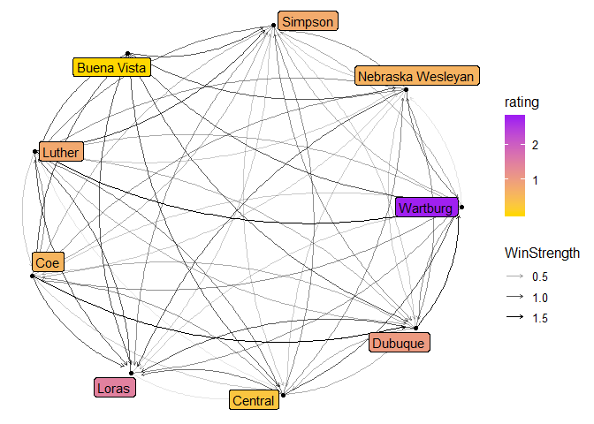

# Men
 


```r
n<-network.initialize(length(all_teams), directed = TRUE, multiple = FALSE)
rankedteams <- rankedteams %>% mutate(ranking = min_rank(desc(Rating)))
network.vertex.names(n) <- as.character(all_teams)
n %v% "rank" <- arrange(rankedteams,match( Team, all_teams))$ranking
n %v% "rating" <- arrange(rankedteams,match( Team, all_teams))$Rating
n %v% "conference" <- as.character(all_conferences)

network.adjacency(as.matrix(A_unnormed), n, ignore.eval=FALSE, names.eval = c("WinStrength"))
```
## Top 25

```r
#rankedteams %>% select(ranking, Team, Rating) %>% knitr::kable()

rankedteams %>% filter(ranking <= 25) %>% select(ranking, Team, Rating, Conference) %>% knitr::kable()
```


 ranking  Team                        Rating  Conference 
--------  -----------------------  ---------  -----------
       1  Christopher Newport       6.413667  CAC        
       2  Johns Hopkins             6.327787  CC         
       3  Mary Washington           6.300057  CAC        
       4  Amherst                   6.016389  NESCAC     
       5  Washington and Lee        5.572463  ODAC       
       6  Calvin                    5.493145  MIAA       
       7  Franklin and Marshall     5.453799  CC         
       8  Oneonta State             4.485276  SUNYAC     
       9  Messiah                   4.363257  MACC       
      10  Tufts                     4.087868  NESCAC     
      11  Catholic                  3.971083  LAND       
      12  Oglethorpe                3.940554  SAA        
      13  Roanoke                   3.840980  ODAC       
      14  Connecticut College       3.604557  NESCAC     
      15  Gettysburg                3.562786  CC         
      16  Montclair State           3.472669  NJAC       
      17  Chicago                   3.387286  UAA        
      18  RPI                       3.361193  LL         
      19  Ohio Wesleyan             3.297469  NCAC       
      20  Gustavus Adolphus         3.210862  MIAC       
      21  Haverford                 3.138754  CC         
      22  Rowan                     3.086689  NJAC       
      23  Luther                    3.031804  ARC        
      24  Kenyon                    3.022743  NCAC       
      25  Claremont-Mudd-Scripps    2.980259  SCIAC      

```r
rankedteams %>% filter(Conference=="ARC") %>% select(ranking, Team, Rating, Conference) %>% knitr::kable()
```


 ranking  Team                    Rating  Conference 
--------  ------------------  ----------  -----------
      23  Luther               3.0318041  ARC        
      41  Loras                2.6671955  ARC        
      71  Simpson              1.7951236  ARC        
      75  Central              1.7827666  ARC        
     109  Wartburg             1.3358760  ARC        
     163  Dubuque              0.9611480  ARC        
     237  Nebraska Wesleyan    0.4418129  ARC        
     339  Coe                  0.1433796  ARC        
     389  Buena Vista          0.0454998  ARC        

```r
rankedteams %>% filter(Team == "Loras")
```

```
##    Team   Rating Conference ranking
## 1 Loras 2.667196        ARC      41
```

## Game Network


```r
#net<-ggnetwork(n %s% which( n %v% "rank" < 26), layout="fruchtermanreingold")
net<-ggnetwork(n , layout="fruchtermanreingold")
ggplot(net, aes(x = x, y = y, xend = xend, yend = yend))+
  geom_edges(alpha=0.1)+
  geom_nodes( aes(color=rating), alpha=0.5 ) +theme_blank()+
  scale_color_gradient(low="purple", high="gold")#+
```

<!-- -->

```r
#  geom_nodetext(aes(label=vertex.names))
```


```r
net<-ggnetwork(n %s% which( n %v% "rank" < 26), layout="fruchtermanreingold")
#net<-ggnetwork(n , layout="fruchtermanreingold")
ggplot(net, aes(x = x, y = y, xend = xend, yend = yend))+
  geom_edges(aes(alpha=WinStrength), curvature = 0.2)+
  geom_nodes(  ) +theme_blank()+
  geom_nodelabel_repel(aes(label=vertex.names, fill=rank))+
  scale_color_gradient(low="purple", high="gold")+
  scale_fill_gradient(low="gold", high="purple")
```

<!-- -->


```r
net<-ggnetwork(n %s% which( n %v% "conference" == "ARC"), layout="fruchtermanreingold")
#net<-ggnetwork(n , layout="fruchtermanreingold")
ggplot(net, aes(x = x, y = y, xend = xend, yend = yend))+
  geom_edges(aes(alpha=WinStrength), curvature = 0.2, arrow = arrow(length = unit(3, "points")))+
  geom_nodes(  ) +theme_blank()+
  geom_nodelabel_repel(aes(label=vertex.names, fill=rating))+
  scale_color_gradient(low="purple", high="gold")+
  scale_fill_gradient(low="gold", high="purple")
```

<!-- -->

# Women


```r
n<-network.initialize(length(all_teams), directed = TRUE, multiple = TRUE)
rankedteams <- rankedteams %>% mutate(ranking = min_rank(desc(Rating)))
network.vertex.names(n) <- as.character(all_teams)
n %v% "rank" <- arrange(rankedteams,match( Team, all_teams))$ranking
n %v% "rating" <- arrange(rankedteams,match( Team, all_teams))$Rating
n %v% "conference" <- as.character(all_conferences)

network.adjacency(as.matrix(A_unnormed), n, ignore.eval=FALSE, names.eval = c("WinStrength"))
```
## Top 25


```r
#rankedteams %>% select(ranking, Team, Rating) %>% knitr::kable()

rankedteams %>% filter(ranking <= 25) %>% select(ranking, Team, Rating, Conference) %>% knitr::kable()
```


 ranking  Team                         Rating  Conference 
--------  -----------------------  ----------  -----------
       1  Messiah                   13.793771  MACC       
       2  Pomona-Pitzer              9.643365  SCIAC      
       3  MIT                        9.057278  NEWMAC     
       4  Dickinson                  8.611713  CC         
       5  Randolph-Macon             8.089854  ODAC       
       6  Arcadia                    8.063929  MACC       
       7  TCNJ                       7.746821  NJAC       
       8  Centre                     7.511777  SAA        
       9  William Smith              7.142240  LL         
      10  Johns Hopkins              7.115187  CC         
      11  Christopher Newport        7.045461  CAC        
      12  Cal Lutheran               6.630379  SCIAC      
      13  Gettysburg                 6.578958  CC         
      14  Haverford                  6.020715  CC         
      15  Wheaton (Ill.)             5.698542  CCIW       
      16  Washington U.              5.558154  UAA        
      17  Tufts                      5.280789  NESCAC     
      18  Salisbury                  5.031897  CAC        
      19  Claremont-Mudd-Scripps     4.827498  SCIAC      
      20  Stevens                    4.659533  MACF       
      21  Chapman                    4.656979  SCIAC      
      22  McDaniel                   4.640234  CC         
      23  Swarthmore                 4.547481  CC         
      24  Washington and Lee         4.449458  ODAC       
      25  Middlebury                 4.026778  NESCAC     

```r
rankedteams %>% filter(Conference=="ARC") %>% select(ranking, Team, Rating, Conference) %>% knitr::kable()
```


 ranking  Team                    Rating  Conference 
--------  ------------------  ----------  -----------
      40  Wartburg             2.7963832  ARC        
      83  Loras                1.5573411  ARC        
     110  Dubuque              1.0984015  ARC        
     135  Simpson              0.8044141  ARC        
     136  Luther               0.8018833  ARC        
     160  Nebraska Wesleyan    0.6572269  ARC        
     163  Coe                  0.6329392  ARC        
     238  Central              0.2964327  ARC        
     424  Buena Vista          0.0013285  ARC        

```r
rankedteams %>% filter(Team=="Loras")
```

```
##    Team   Rating Conference ranking
## 1 Loras 1.557341        ARC      83
```

## Game Network


```r
#net<-ggnetwork(n %s% which( n %v% "rank" < 26), layout="fruchtermanreingold")
net<-ggnetwork(n , layout="fruchtermanreingold")
ggplot(net, aes(x = x, y = y, xend = xend, yend = yend))+
  geom_edges(alpha=0.1)+
  geom_nodes( aes(color=rating), alpha=0.5 ) +theme_blank()+
  scale_color_gradient(low="purple", high="gold")#+
```

<!-- -->

```r
#  geom_nodetext(aes(label=vertex.names))
```


```r
net<-ggnetwork(n %s% which( n %v% "rank" < 26), layout="fruchtermanreingold")
#net<-ggnetwork(n , layout="fruchtermanreingold")
ggplot(net, aes(x = x, y = y, xend = xend, yend = yend))+
  geom_edges(aes(alpha=WinStrength), curvature = 0.2)+
  geom_nodes(  ) +theme_blank()+
  geom_nodelabel_repel(aes(label=vertex.names, fill=rank))+
  scale_color_gradient(low="purple", high="gold")+
  scale_fill_gradient(low="gold", high="purple")
```

<!-- -->

## ARC


```r
net<-ggnetwork(n %s% which( n %v% "conference" == "ARC"), layout="fruchtermanreingold")
#net<-ggnetwork(n , layout="fruchtermanreingold")
ggplot(net, aes(x = x, y = y, xend = xend, yend = yend))+
  geom_edges(aes(alpha=WinStrength), curvature = 0.2, arrow = arrow(length = unit(3, "points")))+
  geom_nodes(  ) +theme_blank()+
  geom_nodelabel_repel(aes(label=vertex.names, fill=rating))+
  scale_color_gradient(low="purple", high="gold")+
  scale_fill_gradient(low="gold", high="purple")
```

<!-- -->
